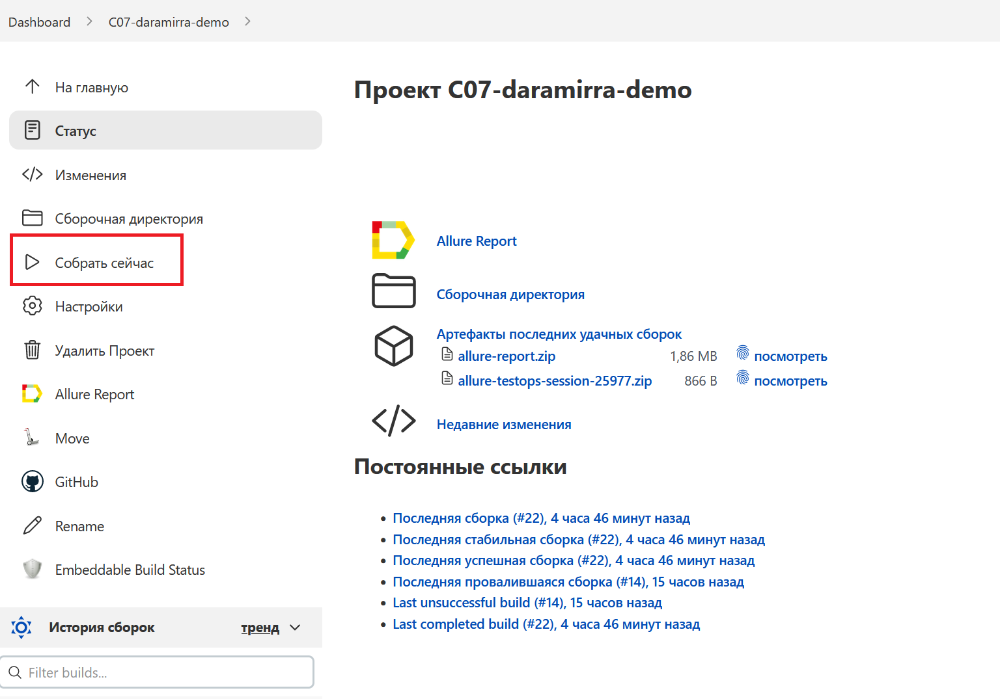
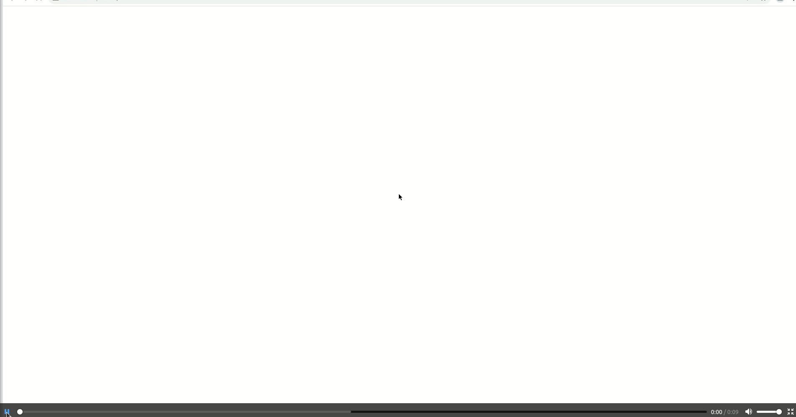
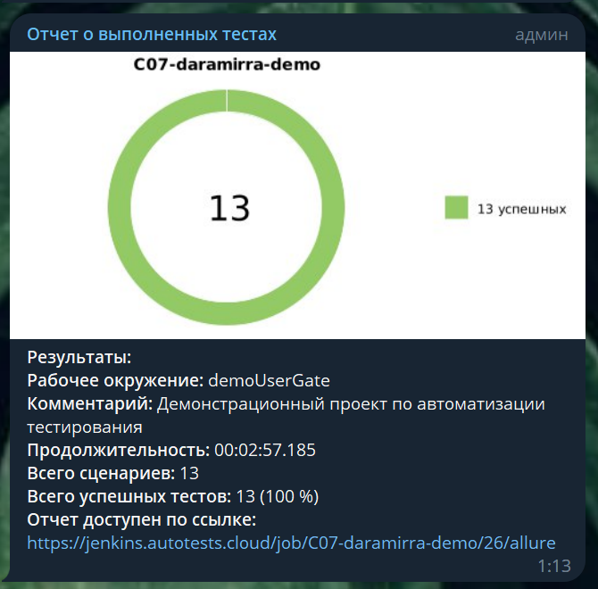

# Проект по автоматизации тестирования демонстрационного стенда [UserGate](https://demo.usergate.com:8001/)

## Технологии и инструменты

<p  align="center"

<code></code>
<code></code>
<code></code>
<code></code>
<code></code>
<code></code>
<code></code>
<code></code>
<code></code>
<code></code>
<code></code>
<code></code>
<code></code>
</p>

> *В данном проекте автотесты написаны на <code><strong>*Java*</strong></code> с использованием фреймворка <code><strong>*Selenide*</strong></code> для UI-тестов.*
>
>*Для сборки проекта используется <code><strong>*Gradle*</strong></code>.*
>
>*<code><strong>*JUnit 5*</strong></code> используется как фреймворк для модульного тестирования.*
>
>*Запуск тестов выполняется из <code><strong>*Jenkins*</strong></code>.*
>
>*<code><strong>*Selenoid*</strong></code> используется для запуска браузеров в контейнерах  <code><strong>*Docker*</strong></code>.*
>
>*<code><strong>*Allure Report, Allure TestOps, Jira, Telegram Bot*</strong></code> используются для визуализации результатов тестирования.*

## Реализованы проверки

>- [x] *Лог консоли браузера на странице входа в Систему не содержит ошибок*
>- [x] *Успешный вход в Систему*
>- [x] *Попытка входа в Систему с неверным регистром значения в поле Логин*
>- [x] *Попытка входа в Систему с указанием спецсимволов в поле Логин*
>- [x] *Попытка входа в Систему с незаполненными полями Логин, Пароль*
>- [x] *Попытка входа в Систему с незаполненным полем Пароль*
>- [x] *Попытка входа в Систему с незаполненным полем Логин*
>- [x] *Попытка входа в Систему с неверным паролем*
>- [x] *Попытка входа в Систему с неверным логином*
>- [x] *Выход из Системы*

## Запуск тестов из терминала

*Запуск тестов с заполненным remote.properties:*

```bash
gradle clean test
```

*Запуск тестов без заполненного remote.properties:*

```bash
gradle clean test 
  -Dbrowser=[BROWSER]
  -DbrowserVersion=[BROWSER_VERSION]
  -DbrowserSize=[BROWSER_SIZE]
  -DremoteDriverUrl=https://[selenoidUser]:[selenoidPwd]@[REMOTE_DRIVER_URL]/wd/hub/
  -DvideoStorage=https://[REMOTE_DRIVER_URL]/video/
  -Dthreads=[THREADS]
  -DaccountPassword=[ACCOUNT_PASSWORD]
  -DbaseUrl=[BASE_URL]
```

где:
>- [x] *Dbrowser - браузер, в котором будут выполняться тесты (по умолчанию chrome)*
>- [x] *DbrowserVersion - версия браузера (по умолчанию 100.0)*
>- [x] *DbrowserSize - размер окна браузера (по умолчанию 1920x1080)*
>- [x] *DremoteDriverUrl - логин, пароль и адрес удаленного сервера, где будут выполняться тесты*
>- [x] *DvideoStorage - хранилище видео выполненных тестов*
>- [x] *Dthreads - количество потоков выполняющихся тестов*
>- [x] *DaccountPassword - пароль учетной записи пользователя для тестов*
>- [x] *DbaseUrl - основной адрес тестового стенда*

*Запуск тестов в несколько потоков:*

```bash
gradle clean test -Dthreads=[threadsValue]
```

*Сформировать allure отчет:*

```bash
./gradle clean test allureReport
```
##  Запуск тестов в [Jenkins](https://jenkins.autotests.cloud/job/C07-daramirra-demo/)

*Для запуска сборки необходимо нажать кнопку <code><strong>*Собрать сейчас*</strong></code>.*

<p align="center">
  
</p>

*После выполнения сборки, в блоке <code><strong>*История сборок*</strong></code> напротив номера сборки появится
значок <code><strong>*Allure
Report*</strong></code>, кликнув по которому, откроется страница с сформированным html-отчетом.*

<p align="center">
  
</p>

##  Отчет о результатах тестирования в [Allure Report](https://jenkins.autotests.cloud/job/C07-daramirra-demo/23/allure/)

### :pushpin: Общая информация

*Главная страница Allure-отчета содержит следующие информационные блоки:*

> - [x] <code><strong>*ALLURE REPORT*</strong></code> - отображает дату и время прохождения теста, общее количество прогнанных кейсов, а также диаграмму с указанием процента и количества успешных, упавших и сломавшихся в процессе выполнения тестов
>- [x] <code><strong>*TREND*</strong></code> - отображает тренд прохождения тестов от сборки к сборке
>- [x] <code><strong>*SUITES*</strong></code> - отображает распределение результатов тестов по тестовым наборам
>- [x] <code><strong>*ENVIRONMENT*</strong></code> - отображает тестовое окружение, на котором запускались тесты (в данном случае информация не задана)
>- [x] <code><strong>*CATEGORIES*</strong></code> - отображает распределение неуспешно прошедших тестов по видам дефектов
>- [x] <code><strong>*FEATURES BY STORIES*</strong></code> - отображает распределение тестов по функционалу, который они проверяют
>- [x] <code><strong>*EXECUTORS*</strong></code> - отображает исполнителя текущей сборки (ссылка на сборку в Jenkins)

<p align="center">
  
</p>

### :pushpin: Список тестов c описанием шагов и визуализацией результатов

*На данной странице представляется стандартное распределение выполнявшихся тестов по тестовым наборам или классам, в
которых находятся тестовые методы.*

<p align="center">
  
</p>

##  Интеграция с [Allure TestOps](https://allure.autotests.cloud/project/2268/dashboards)

*Allure TestOps позволяет управлять как ручным, так и автоматизированным тестированием: создавать тест-кейсы и чек-листы, запускать ручные и автоматические прогоны, заводить дефекты и собирать статистику по проделанной работе. Также у Allure большой набор интеграций с различными инструментами и языками программирования. Allure TestOps позволяет автоматически переносить сценарии тестирования в код и после этого дополнять их кодом. При запуске тестов можно выбирать какие именно кейсы необходимо запустить.*

### :pushpin: Основной дашборд

<p align="center">
  
</p>

### :pushpin: Запуски

<p align="center">
  
</p>

### :pushpin: Результат запуска

<p align="center">
  
</p>

### :pushpin: Тест-кейсы

<p align="center">
  
</p>

##  Интеграция с [Jira](https://jira.autotests.cloud/browse/HOMEWORK-698)

*В проекте реализована интеграция с Jira, что позволяет добавлять в задачи тест-кейсы, запуски и их результаты.*

<p align="center">
  
</p>

##  Пример запуска теста в Selenoid

<p align="center">
  
</p>

##  Уведомления в Telegram

*После завершения сборки Telegram-бот автоматически обрабатывает и отправляет сообщение с отчетом о прогоне.*

<p align="center">
  
</p>